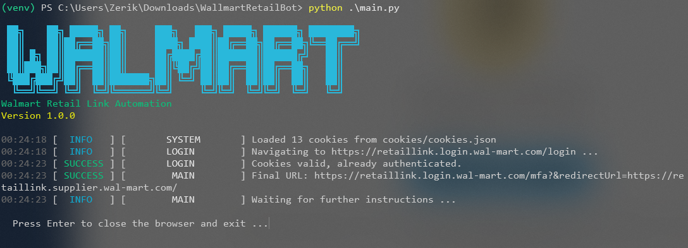

<h1 align="center">Walmart Retail Link Automation</h1>

<div align="center">
  <a href="https://python.org">
    
  </a>
  <a href="https://playwright.dev">
    
  </a>
  <a href="https://pypi.org/project/playwright-stealth/">
    
  </a>
  <a href="https://pypi.org/project/colorama/">
    
  </a>
  <a href="LICENSE">
    
  </a>
</div>

<p align="center">
  
</p>

<br>

> **main** branch — stable releases.  
> **dev** branch — active development, unstable. Clone and switch to `dev` for the latest changes.

Automated login for [Walmart Retail Link](https://retaillink.login.wal-mart.com/login) using Playwright with stealth protection, PerimeterX challenge handling, MFA (Symantec VIP) support, and cookie persistence.

## Features

- **Stealth browser automation** — evades bot detection via `playwright_stealth`
- **PerimeterX challenge handling** — detects and attempts automated bypass of PX press-and-hold challenges
- **MFA support** — handles Symantec VIP two-factor authentication flow
- **Cookie persistence** — saves session cookies after login to skip re-authentication on subsequent runs
- **Colorised logging** — centralised logger with tags and severity levels via `colorama`

## Prerequisites

- Python 3.12+
- Google Chrome or Chromium-based browser
- Walmart Retail Link account with Symantec VIP Access App configured

## Installation

1. **Clone the repository**

   ```bash
   git clone https://github.com/Zerik-Official/Walmart-Retail-Link-Automation.git
   cd Walmart-Retail-Link-Automation
   ```

2. **Switch to the development branch**

   ```bash
   git checkout dev
   ```

3. **Create and activate a virtual environment**

   ```bash
   python -m venv venv
   # Windows
   venv\Scripts\activate
   # Linux / macOS
   source venv/bin/activate
   ```

4. **Install dependencies**

   ```bash
   pip install -r requirements.txt
   ```

5. **Install Playwright Chromium browser**

   ```bash
   playwright install chromium
   ```

6. **Configure credentials**

   Copy the environment file and fill in your credentials:

   ```bash
   cp .env.example .env
   ```

   Edit `.env`:

   ```env
   WALMART_USERNAME=your_username
   WALMART_PASSWORD=your_password
   CHROMIUM_PATH=
   HEADLESS=false
   LOGIN_URL=https://retaillink.login.wal-mart.com/login
   USER_DATA_DIR=chrome_profile
   ```

## Usage

Run the script:

```bash
python main.py
```

The script will:

1. Show an ASCII banner with version info
2. Load saved cookies from `cookies/cookies.json` if available (skips login if still valid)
3. Launch a Chromium browser with stealth patches
4. Navigate to the Walmart Retail Link login page
5. Fill in your credentials and click **LOG IN**
6. Detect and attempt to bypass any **PerimeterX** challenge
7. If prompted, complete the **Symantec VIP MFA** flow by entering the OTP code from your app
8. Save session cookies for future runs
9. Keep the browser open until you press **Enter**

## Project Structure

```
Walmart-Retail-Link-Automation/
├── browser/
│   ├── __init__.py
│   ├── captcha_handler.py   # PerimeterX challenge detection & bypass
│   ├── cookie_manager.py    # Cookie persistence (save / load)
│   ├── mfa_handler.py       # Symantec VIP MFA flow
│   └── manager.py           # BrowserManager with stealth + cookie API
├── config/
│   ├── __init__.py
│   └── settings.py          # Typed settings from .env
├── utils/
│   ├── __init__.py
│   ├── info.py              # ASCII colour banner
│   └── logger.py            # Centralised logger with tags & levels
├── cookies/                 # Persistent session cookies (gitignored)
├── .github/
│   └── example.png          # Repository preview image
├── main.py                  # Entry point — full login orchestration
├── .env                     # Credentials (gitignored)
├── .env.example
├── .gitignore
├── LICENSE.txt
├── requirements.txt
└── README.md
```

## Environment Variables

| Variable            | Required | Default                                                              | Description                |
| ------------------- | -------- | -------------------------------------------------------------------- | -------------------------- |
| `WALMART_USERNAME`  | Yes      | —                                                                    | Retail Link username       |
| `WALMART_PASSWORD`  | Yes      | —                                                                    | Retail Link password       |
| `CHROMIUM_PATH`     | No       | Playwright's bundled Chromium                                        | Custom browser executable  |
| `HEADLESS`          | No       | `false`                                                              | Run browser in headless mode |
| `LOGIN_URL`       | No       | `https://retaillink.login.wal-mart.com/login`                        | Login page URL             |
| `USER_DATA_DIR`   | No       | —                                                                     | Path to persistent Chrome profile (full state preservation) |

## License

MIT
